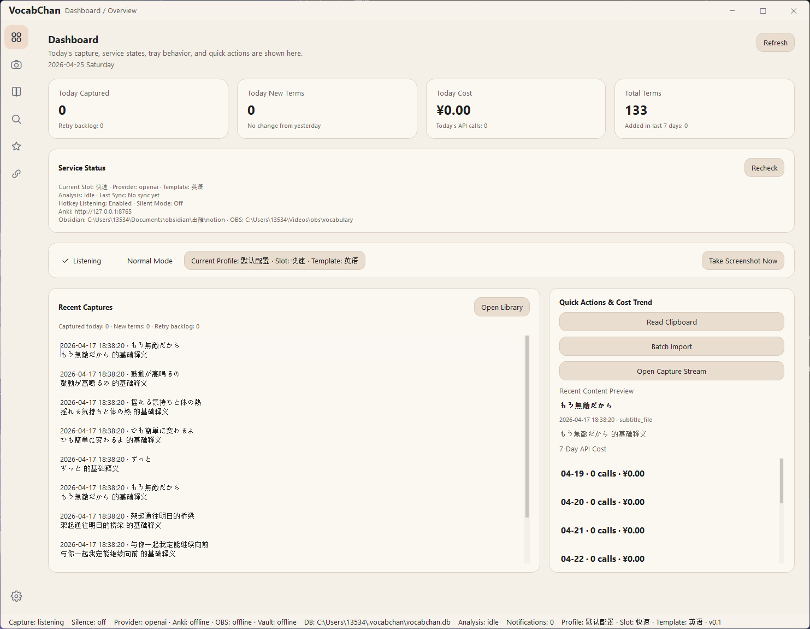
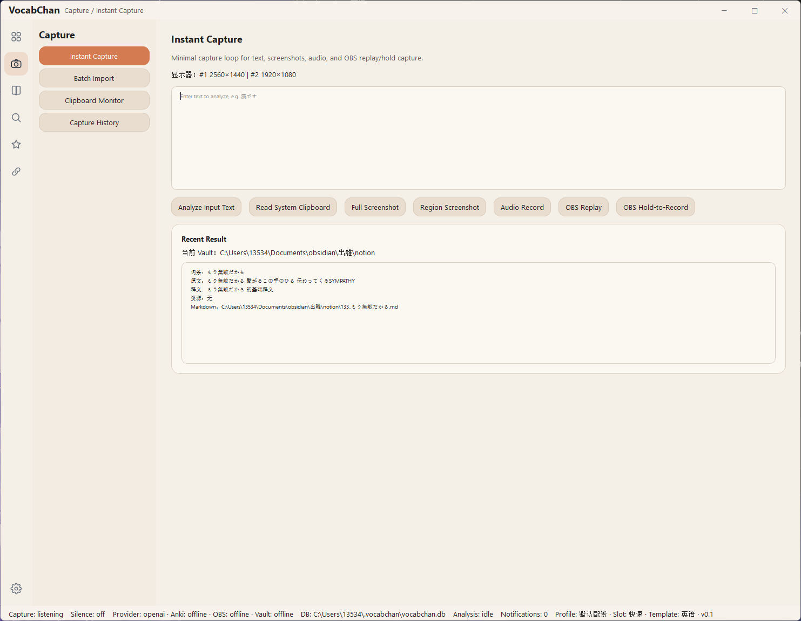
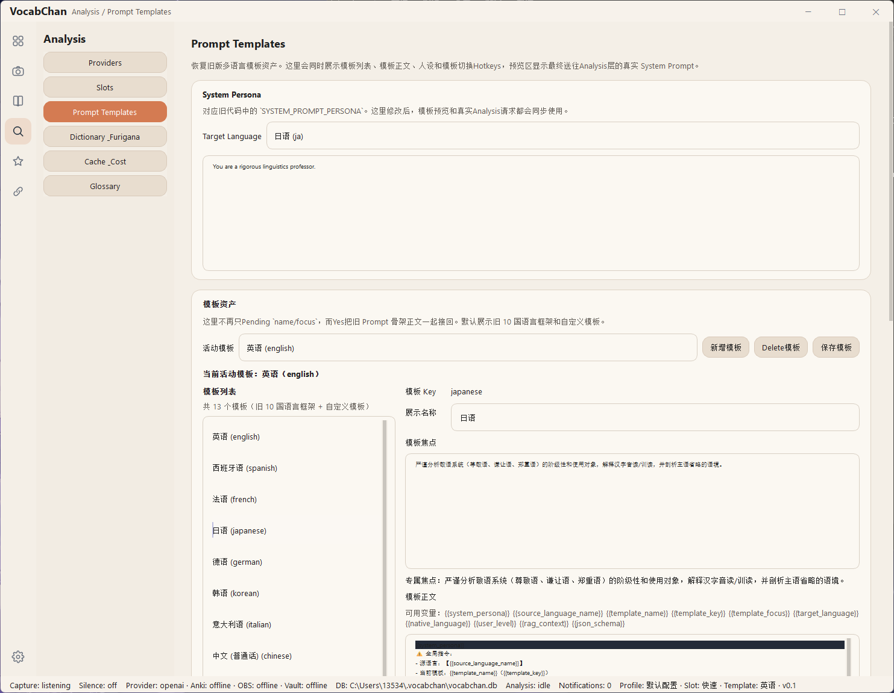
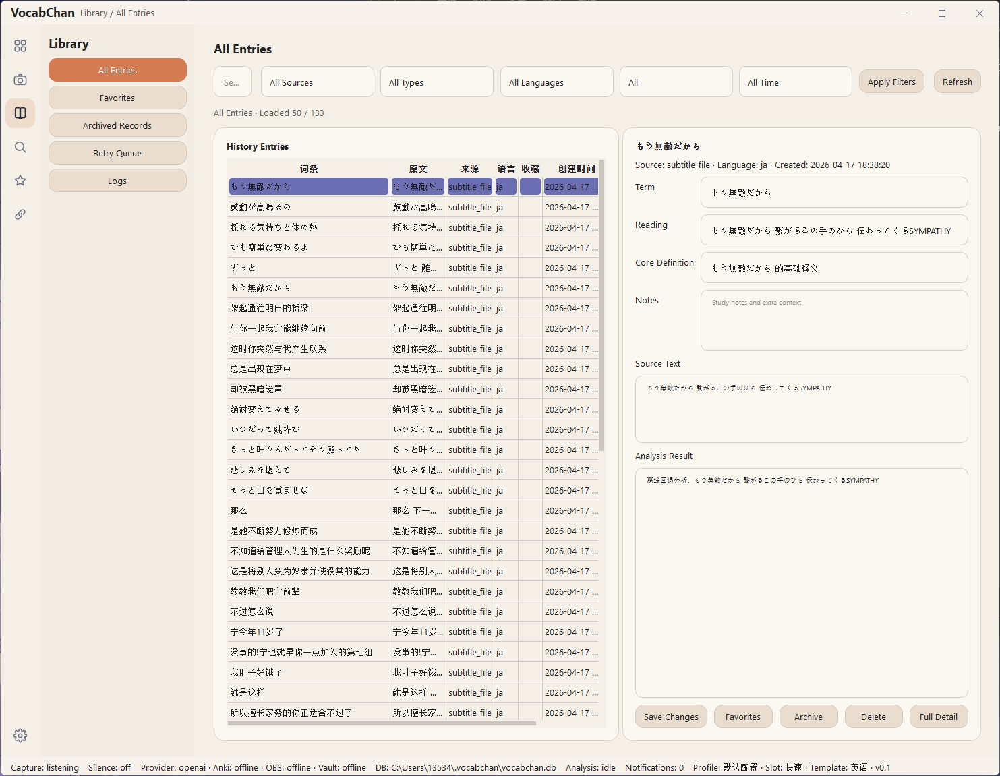
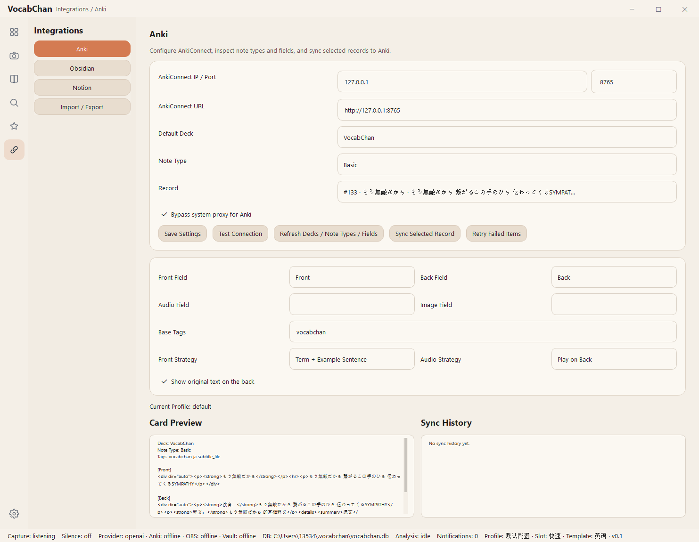

# VocabChan

[English](./README.md) · [中文](./README_CN.md) · [日本語](./README_JP.md)

> A local-first desktop app for immersive language learning.

> VocabChan is under active development and productization. The Windows workflow is usable, but some features are still being refined and tested. Running from Python source is currently the recommended way to evaluate the project.

---

## What Is VocabChan

VocabChan is an open-source desktop app built for learners who study from real-world language input instead of only textbook examples.

It is designed for situations like:

- games
- anime
- YouTube
- manga
- subtitles
- copied text
- screenshots
- audio clips
- recorded media

The goal is not just to translate a sentence.

VocabChan is designed to turn real input into a complete desktop-native learning workflow:

**capture -> preprocess -> analyze -> store -> export/sync -> review later**

That means one tool can handle:

- collecting language from real media
- enriching it with OCR / ASR and AI analysis
- saving it locally in a structured way
- exporting it to tools like Anki and Obsidian
- revisiting it later as part of long-term learning

---

## Why This Project Exists

Many language-learning tools only solve one part of the workflow:

- OCR only
- translation only
- flashcards only
- notes only
- browser-only overlays

VocabChan is designed as a local-first desktop workspace that unifies the full pipeline in one place.

It is intended to fill a practical open-source gap for learners who want to study from real media with a low-friction workflow, while still keeping their data, assets, and history local and reusable.

---

## Current Status

VocabChan is currently moving from a validated prototype toward a release-ready desktop application.

The public repository is meant to show both:

- the working foundation that already exists
- the broader product scope that is actively being built

Some workflows are already usable today, while some documented features are still in progress. The README reflects the real product direction and repository scope, not only the smallest currently exposed code path.

Current productization work is focused on **Windows desktop first**.

---

## Who It Is For

VocabChan is designed for:

- immersive Japanese learners
- self-learners working across multiple languages
- learners who already use tools like Anki and Obsidian
- users who want a desktop-native, low-friction, local-first workflow
- people who want to study from real input such as games, videos, manga, subtitles, and screenshots

---

## What Makes It Different

VocabChan is not just an OCR tool, not just a translator, and not just an Anki exporter.

It is designed as a single desktop workspace that can unify:

- capture from clipboard, screenshots, selected screen regions, audio, OBS replay, and imported files
- preprocessing with OCR, ASR, text cleanup, and optional local engines
- AI analysis tailored to the target language
- local SQLite storage for long-term accumulation
- export and sync to learning tools such as Anki and Obsidian
- review-oriented follow-up workflows, including Workshop-generated learning content

A key part of the project is that it treats language learning as a long-term accumulation workflow rather than a one-off translation action.

---

## Core Feature Areas

### 1. Multi-source capture

VocabChan can capture language from multiple real-world sources:

- clipboard text
- clipboard image input
- full screenshot capture
- selected region capture
- microphone or system-audio recording
- OBS replay buffer capture
- OBS hold-to-record workflows
- subtitle file import
- image file import
- audio file import
- clipboard batch import
- optional screenshot preview before analysis

### 2. AI analysis and enrichment

VocabChan can analyze captured content with:

- configurable AI providers and models
- language-specific prompt templates
- translation and grammar explanation
- vocabulary breakdown and usage notes
- pronunciation guidance
- contextual explanation instead of generic translation only
- glossary-aware prompting
- repeated-word detection
- retry queue for failed requests
- optional local OCR with PaddleOCR
- optional local ASR with Faster-Whisper
- optional privacy masking for sensitive data before sending to AI

### 3. Local-first storage and long-term memory

VocabChan keeps data in a reusable local workflow:

- local SQLite persistence
- saved assets for screenshots, audio, and other media
- searchable history
- logs and retry queue
- editing and export surfaces
- accumulated vocabulary and example history
- statistics and review-oriented views

### 4. Export and integrations

VocabChan is designed to work with existing learning tools instead of replacing them:

- Obsidian Markdown export
- AnkiConnect sync
- CSV / TSV / TXT export
- configurable output behavior for cards and notes
- optional media backup workflows

### 5. Workshop-generated learning content

VocabChan also includes a Workshop direction for turning saved vocabulary into reusable learning material such as:

- short stories
- dialogue scripts
- lightweight vocabulary games
- generated follow-up study content
- history and export for generated content

This module is already part of the repository and is being further refined as part of the broader productization process.

---

## Language-Specific Analysis Templates

One of VocabChan’s core ideas is that different languages need different kinds of explanation.

Instead of a generic “translate this” prompt, VocabChan uses language-oriented templates that tell the model what to focus on for the target language.

Built-in presets include:

| Language | Example focus |
|---|---|
| Japanese | honorific systems, omitted subjects, on/kun readings, context-heavy sentence interpretation |
| English | pronunciation vs spelling mismatch, phrasal verbs, usage nuance |
| Spanish | verb conjugation, subjunctive triggers, gender |
| French | gender patterns, liaison, pronunciation vs spelling |
| German | cases, gender, verb-final clause structure |
| Korean | speech levels, honorifics, sound change patterns |
| Italian | agreement, verb inflection, discourse nuance |
| Chinese | tones, character structure, measure words |
| Portuguese | nasal pronunciation, EU vs BR differences |
| Arabic | MSA vs dialects, root patterns, contextual script forms |
| Custom slots | user-defined analysis focus for any target language |

This helps make the analysis more useful for real learners than a generic translation-only workflow.

---

## Supported AI Providers

VocabChan is designed to work with multiple providers. Current configuration direction includes support for services such as:

- OpenAI
- Google Gemini
- Claude
- DeepSeek
- Grok
- Qwen
- Kimi
- Doubao
- MiniMax
- OpenRouter

Users can configure only the providers they actually want to use. The project is not tied to a single vendor.

---

## Example Workflows

### 1. Instant capture while reading or watching

1. Trigger a hotkey or capture from the clipboard.
2. Capture text, image, audio, or replay media.
3. Run preprocessing such as OCR / ASR if needed.
4. Send the result to the configured AI analysis pipeline.
5. Save the result locally.
6. Export or sync to Anki / Obsidian if needed.
7. Revisit it later in the library.

### 2. Batch import from study material

1. Import subtitles, images, audio, or other source files.
2. Preview, split, and analyze in batches.
3. Save results into the local database.
4. Export selected outputs into downstream tools.

### 3. Long-term accumulation and reuse

1. Keep collecting real-world language input.
2. Build a searchable personal vocabulary and sentence history.
3. Review, organize, and export what matters.
4. Generate follow-up study content from stored material.

---

## Screenshots

### Main Window


### Capture


### Analysis


### Library


### Integrations


---

## Tech Stack

- **Language:** Python 3.11+
- **Desktop UI:** PySide6
- **Storage:** SQLite + local asset files
- **Packaging:** PyInstaller
- **Architecture direction:** local-first desktop app with modular services, event bus, async host, task engine, and Qt-based UI shell

---

## Project Layout

```text
src/vocabchan/
  app/
  gui/
  infrastructure/
  storage_adapter/
  task_engine/
  unified_interface/
  shared/

scripts/
tests/
resources/
docs/
```

---

## Setup

### Prerequisites

**Required**

- Python 3.11+
- at least one supported AI provider API key

**Optional but recommended depending on workflow**

- [Obsidian](https://obsidian.md/) for Markdown-based knowledge storage
- [Anki](https://apps.ankiweb.net/) + [AnkiConnect](https://ankiweb.net/shared/info/2055492159) for flashcard sync
- OBS Studio for replay / recording workflows
- PaddleOCR for local OCR
- Faster-Whisper for local ASR

### Install

```bash
git clone https://github.com/sandleft/vocabchan
cd vocabchan
pip install -e ".[dev]"
```

### Run

```bash
python main.py
```

or

```bash
python -m vocabchan
```

---

## Configuration

Configure the project with your preferred providers, models, paths, and integrations.

Typical configuration areas include:

- API keys and provider selection
- Obsidian vault path
- AnkiConnect URL and field mapping
- OBS WebSocket settings
- proxy configuration
- capture behavior and hotkeys
- OCR / Whisper options
- export behavior and output paths

Most settings are intended to be adjustable through the application’s configuration UI rather than by rebuilding the app.

---

## Default Hotkeys

Hotkeys are configurable, but the current default workflow includes actions such as:

| Hotkey | Action |
|---|---|
| `F4` | screenshot + audio, fast analysis |
| `F6` | screenshot + audio, deep analysis |
| `F2` | clipboard text analysis |
| `F7` | hold-to-record OBS workflow |
| `F12` | OBS replay buffer capture |
| `F8` / `F9` | screenshot analysis |
| `F10` / `F11` | audio analysis |
| `Alt+1~7` | model slot actions |
| `Alt+Z / X / C` | switch language template |
| `Alt+S` | search saved entries |
| `Alt+Q` | open study statistics |
| `Alt+E` | export CSV |
| `Alt+W` | export TXT |
| `Alt+B` | batch import from clipboard |
| `Alt+R` | select capture region |

---

## Testing

```bash
pytest tests/unit/
pytest tests/integration/
pytest tests/e2e/
```

For packaging and release regression checks:

```bash
python scripts/package_release.py --dry-run
python scripts/release_regression.py --dry-run
```

---

## Non-Goals

VocabChan is intentionally not trying to be:

- a browser DOM translation overlay
- a galgame hook platform
- a replacement for Anki
- a cloud-first social learning platform

It is meant to be a desktop-native, local-first language input and learning workflow hub.

---

## Notes

- API keys are intended to stay in local configuration and are not part of the repository
- Anki sync requires Anki to be running with AnkiConnect enabled
- OBS features require OBS WebSocket to be enabled
- first-time local OCR / Whisper setup may require model downloads
- screenshots and audio files are stored locally
- the Windows EXE build is still in testing

---

## License

MIT
